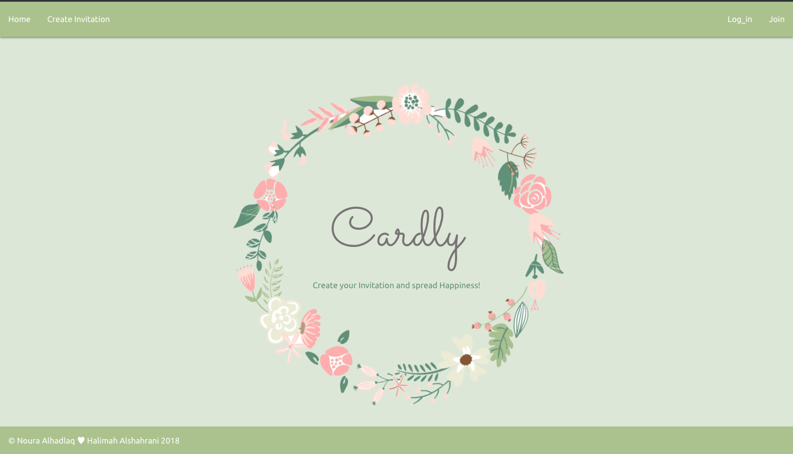

# Cardly web App

### [ Heroku Link](https://cardly-invitation.herokuapp.com/)

## Team Members:

- Halima [https://github.com/Halima95]
- Noura Alhadlaq [https://github.com/NouraAlhadlaq]

## Description :

A full-stack application using Ruby on rails.

## Concept :

The idea of this project is to get rid of using paper invitation cards and start using E-invitations.

## Built with :

- [Ruby on Rails](https://rubyonrails.org/)
- HTML
- CSS

## Additional Libraries :

- [materialize](https://materializecss.com/)
- [Google fonts](https://fonts.google.com/)

## Gems used :
- Devise
- mailgun

## Hosting :

- [Heroku](https://www.heroku.com/)

## API used :
- [QR Code Generator](http://goqr.me/api/)
- [mailgun](https://www.mailgun.com/)

## Approach :

First of all was deciding what we actually wanted to build , and dividing the work between team members using [Trello](https://trello.com). Getting used with [Github](https://github.com). 

## Challenges:

Getting used with API'S . 

## What's next:

There's many additons to be added to this project such as : 
- Tracking invitees status.
- Adding invitation themes.
- Calendar add. 

## Credits:

- Jack Jeffress
- Moath Althawad

